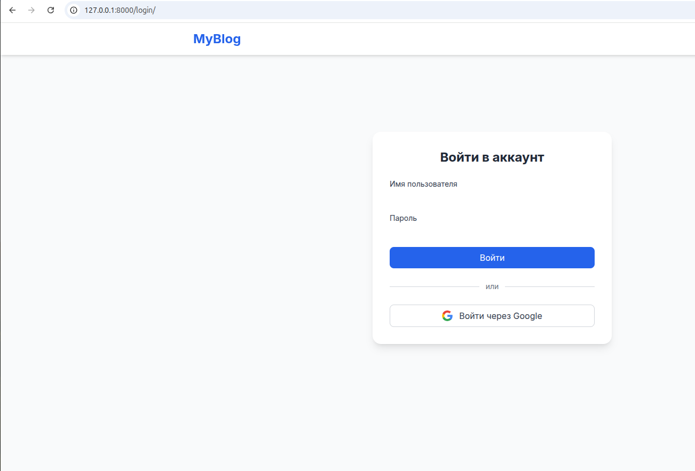

# OpenPost

OpenPost — это веб-приложение на Django для публикации и управления постами.

## Вход через Google

В проекте реализована возможность входа через Google OAuth. Для этого на странице входа есть кнопка "Войти через Google". После авторизации вы сможете пользоваться всеми возможностями приложения.



Перед началом работы с проектом выполните следующие шаги:

1. Установите все необходимые зависимости с помощью Poetry:
    ```bash
    poetry install
    ```

2. Создайте файл `.env` для конфигурации переменных окружения. Пример заполнения смотрите в файле `.env_example`.

3. Запустите проект командой:
    ```bash
    poetry run python manage.py runserver
    ```
